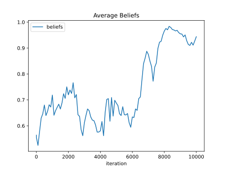
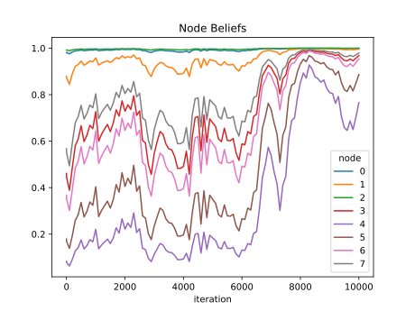

# Processing Results
Simulation results can be processed using the `analysis` module from PolyGraphs. The `analysis` module contains a `Processor` class that combines information from `.hd5`, `.bin`, `config.json` and `data.csv` files from multiple simulation folders into a single pandas DataFrame for analysis.

Import the analysis module and initialise a processor:

```python
from polygraphs.analysis import Processor

processor = Processor()
``` 

By default, it will look inside the `~/polygraphs-cache/results` directory, and all subsequent subdirectories. You can also specify a specific folder as an argument for the `Processor` class:

```python
processor = Processor("~/polygraphs-cache/results/2024-04-25")
```

The `.sims` attribute returns a DataFrame containing some basic information about each simulation that was found inside the directory.

```python
processor.sims
```

The DataFrame will contain the following columns:

| Column             | Description                                                       |
|--------------------|-------------------------------------------------------------------|
| `bin_file_path`    | Path to binary file containing graph and initial beliefs          |
| `hd5_file_path`    | Path to HDF5 file containing iterations                           |
| `config_json_path` | Path to configuration JSON file                                   |
| `trials`           | Number of trials                                                  |
| `network_size`     | Network size                                                      |
| `network_kind`     | Network kind                                                      |
| `op`               | PolyGraphs Op                                                     |
| `epsilon`          | Epsilon value                                                     |
| `uid`              | Unique identifier of simulation directory                         |
| `steps`            | Number of steps                                                   |
| `duration`         | Duration of simulation in seconds                                 |
| `action`           | Action A or B                                                     |
| `undefined`        | `True` if graph beliefs contain undefined values (`nan` or `inf`) |
| `converged`        | Covered (True/False)                                              |
| `polarized`        | Polarized (True/False)                                            |


## Getting Graphs
The NetworkX graph for a particular simulation can be accessed using the `graphs` object and the index of the row of a specific simulation from the DataFrame:
```python
processor.graphs[0]
```

The `graphs` objects can also be accessed as an iterator for list comprehensions and loops:

```python
for g in processor.graphs:
    print(g)
```

### Getting Edge and Node Data
Node and edge data set by a PolyGraph Op can be accessed from the `pg` dictionary inside the NetworkX Graph:

```python
processor.graphs[0].pg
```
```python
{
  'ndata': {
    'reliability': tensor([1., 1., 1., 1., 1., 1., 1., 1., 1., 1., 1., 1., 1., 1., 1., 1.]),
    'logits': tensor([0.0040, 0.0040, 0.0040, 0.0040, 0.0040, 0.0040, 0.0040, 0.0040, 0.0040,
        0.0040, 0.0040, 0.0040, 0.0040, 0.0040, 0.0040, 0.0040]),
    'beliefs': tensor([0.2769, 0.4259, 0.8430, 0.0562, 0.3886, 0.5403, 0.3771, 0.8442, 0.2056,
        0.1630, 0.3488, 0.7576, 0.8517, 0.8152, 0.4326, 0.3256]),
  'edata': {}
 }
```

## Getting Beliefs
The beliefs for each node at every iteration of the simulation can be accessed using the `beliefs` object. You can specify and index to a specific simulation row from the DataFrame or iterate it to access all beliefs.
```python
processor.beliefs[0]
```
Belief data is returned as a pandas MultiIndex DataFrame:
<table>
  <thead>
    <tr style="text-align:right">
      <th></th>
      <th></th>
      <th>beliefs</th>
    </tr>
    <tr>
      <th>iteration</th>
      <th>node</th>
      <th></th>
    </tr>
  </thead>
  <tbody>
    <tr>
      <th rowspan="5" valign="top">0</th>
      <th>0</th>
      <td>0.496257</td>
    </tr>
    <tr>
      <th>1</th>
      <td>0.768222</td>
    </tr>
    <tr>
      <th>2</th>
      <td>0.088477</td>
    </tr>
    <tr>
      <th>3</th>
      <td>0.13203</td>
    </tr>
    <tr>
      <th>4</th>
      <td>0.307423</td>
    </tr>
    <tr>
      <th>...</th>
      <th>...</th>
      <td>...</td>
    </tr>
    <tr>
      <th rowspan="5" valign="top">400</th>
      <th>3</th>
      <td>0.334397</td>
    </tr>
    <tr>
      <th>4</th>
      <td>0.016799</td>
    </tr>
    <tr>
      <th>5</th>
      <td>0.131956</td>
    </tr>
    <tr>
      <th>6</th>
      <td>0.237468</td>
    </tr>
    <tr>
      <th>7</th>
      <td>0.664702</td>
    </tr>
  </tbody>
</table>

Average beliefs for a simulation can be quickly plotted from pandas using a `groupby`:

```python
processor.beliefs[0].groupby("iteration").mean().plot(title="Average Credence")
```



Alternatively, you can convert the MultiIndex beliefs DataFrame to a wide format using the `pivot_table` method from pandas and plot individual node beliefs:

```python
processor.beliefs[0].pivot_table(values="beliefs", index="iteration", columns="node").plot(title="Node Beliefs")
```




## Adding Configuration Parameters
Parameters from the configuration file `configuration.json` inside a simulation can be added as a column using the `add_config()` method. You can provide multiple parameters at once.
```python
processor.add_config("wattsstrogatz.probability", "wattsstrogatz.knn")
```

## Including and Excluding Simulation Parameters
You can include and exclude simulation directories using the parameters in the `configuration.json` file, in this example only complete networks of size 16 are processed:

```python
processor = Processor(include={"network.kind": "complete", "network.size": "16"})
```

You can also exclude simulations by parameter, below random networks are excluded:

```python
processor = Processor(exclude={"network.kind": "random"})
```

## Disabling Configuration File Check
To disable the processor raising errors when the directory names of simulations do match the `simulation.results` parameter of the `configuration.json` file, add a `config_check=False` parameter to the processor initialisation:

```python
processor = Processor(config_check=False)
```

## Creating Custom Columns
Custom columns can be defined by extending the `Processor` class to access the `dataframe` object inside the class and adding columns using the `add()` method during initialisation. In the example below, a `MyPolygraphProcessor` class is created and two methods for calculating the number of edges and a majority function that determines which iteration a particular threshold was met is added as columns to the results DataFrame called `self.dataframe` which is returned by `processor.sims`.

```python
import numpy as np
import pandas as pd
import networkx as nx

from polygraphs.analysis import Processor

class MyPolygraphProcessor(Processor):
    def __init__(self, path):
        super().__init__(path)
        # Add the columns when processor is initialised
        self.add(self.edges(), self.majority(0.5, 0.75))

    def edges(self):
        """Use NetworkX to count number of edges in graph for all sims"""
        edges_list = [nx.number_of_edges(graph) for graph in self.graphs]
        self.dataframe["edges"] = edges_list
        
    def majority(self, *thresholds):
        """Use the beliefs dataframe to find when average beliefs first met a given threshold"""
        def get_majority(iterations, threshold=0.5):
            # Average belief of all nodes at each iteration
            mean_iteration = iterations.groupby("iteration").mean()
            # Filter out the iterations that do not meet threshold
            iterations_above_threshold = mean_iteration[mean_iteration['beliefs'] > threshold]
            # Check that the we found a threshold
            if len(iterations_above_threshold) > 0:
                # Return the first remaining iteration (the index)
                return iterations_above_threshold.index[0]
            else:
                return None

        
        # Loop through list of arguments
        for threshold in thresholds:
            threshold = float(threshold)
            if 0 <= threshold and threshold <= 1:
                # Call get_majority function on each simulation beliefs
                majority_list = []
                for belief in self.beliefs:
                    majority_list.append(get_majority(belief, threshold))
                # Add a column to dataframe
                column = "majority_" + str(threshold).replace(".", "_")
                self.dataframe[column] = majority_list
```

The first `__init__()` is used to initialise the `Processor` class. The `edges()` method accesses all of the graphs in the simulations using the `self.get_graphs()` method and uses the `number_of_edges()` method from NetworkX. This list is then added as a column to `self.dataframe` which contains the data that is returned when calling `processor.get()`.

The second more complex method called `majority()` accepts multiple arguments and uses a custom `get_majority()` function to calculate when a given average belief threshold was met.

We initialise the new results processor and use the `add()` method to add new columns using the methods from our extended class with any optional arguments to the results DataFrame. We can use the processor as follows:

```python
x = MyPolygraphProcessor("~/polygraphs-cache/results/")
x.sims
```

## Next Steps
- Analysis techniques for looking at the number of steps
